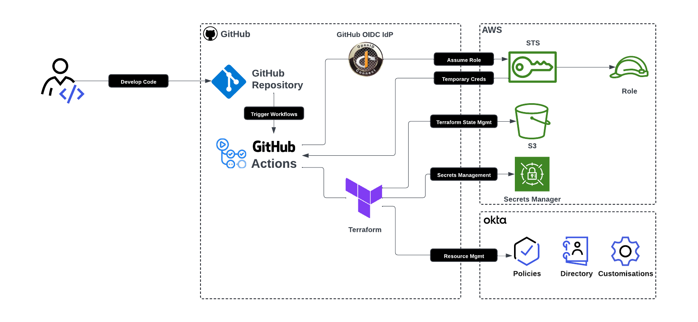
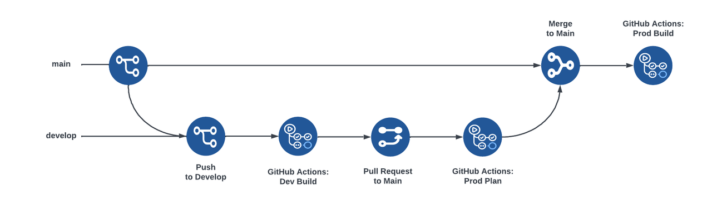

# Secure CI/CD pipeline using Okta Terraform example

This repository contains a project template for a CI/CD pipeline using Okta Terraform, AWS, and GitHub Actions. Please read [How to Create a Secure CI/CD Pipeline Using Okta Terraform][blog] for a detailed guide through.

The architecture for this project looks like




And workflow for this project looks like abc



- [Secure CI/CD pipeline using Okta Terraform example](#secure-cicd-pipeline-using-okta-terraform-example)
  - [Prerequisites](#prerequisites)
  - [Create accounts](#create-accounts)
  - [Configure variables](#configure-variables)
  - [Links](#links)
  - [Help](#help)
  - [License](#license)

## Prerequisites
  * IDE with a Terraform plugin, such as [Visual Studio Code](https://code.visualstudio.com/) or [IntelliJ IDEA](https://www.jetbrains.com/idea/)
  * [Git](https://git-scm.com/)
  * Terminal window
  * [Okta Workforce Identity Cloud Developer Edition account](https://developer.okta.com/signup/)
  * [GitHub account](https://github.com/) and a [GitHub organization account](https://docs.github.com/en/organizations/collaborating-with-groups-in-organizations/creating-a-new-organization-from-scratch) (You can create a free GitHub organization if you don't have access to one)
  * A free [AWS account](https://signin.aws.amazon.com/signup?request_type=register)

> [Okta](https://developer.okta.com/) has Authentication and User Management APIs that reduce development time with instant-on, scalable user infrastructure. Okta's intuitive API and expert support make it easy for developers to authenticate, manage and secure users and roles in any application.


## Create and configure accounts

Create a free Okta Developer Edition account. In the Okta Admin Console, create an API Services application using a public/private key pair generated by Okta. Enable `okta.groups.manage` scope and add `Organization Administrator` as an admin role.

In the AWS account, set up an S3 bucket and a DynamoDB Table for the Terraform backend, and use Secrets Manager for the API Services application private key. Setup the OIDC Identity Provider for GitHub, and the Role and Policy within AWS IAM to allow authentication and authorization to the configured AWS Resources.

In the GitHub account, create or use an existing GitHub Organization, and create a new repository using this project as the template. Set the `AWS_ROLE_ARN` and `AWS_REGION` repository variables with the respective values from AWS.

## Build the CI/CD pipeline using Terraform and Okta

### Setup branches

Create and checkout the develop branch.

```
git checkout main
git pull origin main
git checkout -b develop
```

### Configure variables

Update the `backend-*.conf` and `tfvars` files and replace variables with values from your Okta account, AWS account, and GitHub.

### Configure resources and variables

Uncomment the pre-defined resources and variables within the `terraform/modules/directory/variables.tf`, `terraform/modules/directory/okta_groups.tf`, `terraform/variables.tf`, `terraform/main.tf`, and `tfvars` files to prepare for creating a group within the Okta environments.

### Push the changes to develop

Stage and push the changes to the develop branch to trigger the GitHub Actions workflow `Dev Build`, which uses Terraform to build against the Okta development environment.

```
git add .
git commit -m "Initial commit"
git push origin develop
```

Observe the workflow within GitHub Actions.

### Pull request to main

Create a pull request from develop to main within the repository to trigger the GitHub Actions workflow `Prod Plan`, which uses Terraform to show the potential changes without applying them against the Okta production environment. Observe the workflow within GitHub Actions.

### Merge to main

Merge the pull request to main within the repository to trigger the GitHub Actions workflow `Prod Build`, which uses Terraform to build against the Okta production environment. Observe the workflow within GitHub Actions.


## Links

This example uses the following open source libraries from Okta:

* [Okta Terraform Provider](https://github.com/okta/terraform-provider-okta)

## Help

Please post any questions as comments on the [blog post][blog], or visit our [Okta Developer Forums](https://devforum.okta.com/).

## License check

Apache 2.0, see [LICENSE](LICENSE).

[blog]: https://developer.okta.com/blog/2024/10/11/terraform-ci-cd

